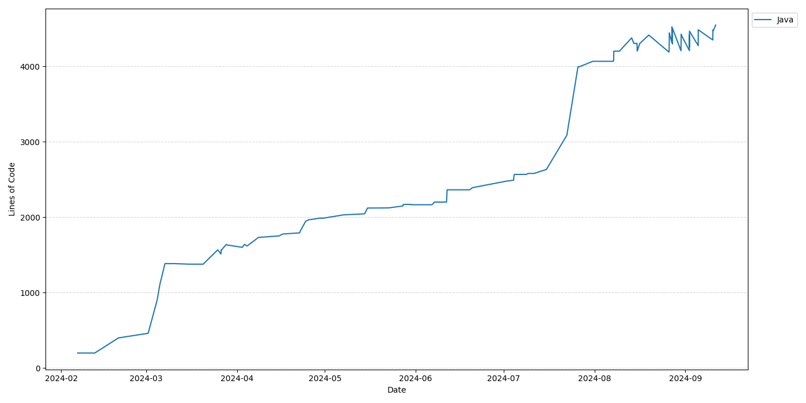

# Git LOC Plot

Plots lines of code over time in a Git repository.

This script uses [cloc](https://github.com/AlDanial/cloc) to count lines of code in each commit of a branch in a given repository. 

The output consists of two files:

* CSV file with lines of code per language over time:

    ```
    date,language,code
    2025-04-07 16:41:58+03:00,Java,549
    2025-04-07 16:30:41+03:00,Java,549
    2024-11-29 09:25:50+02:00,Java,522
    ```
* PNG image:

    

## Dependencies
* python3 (`sudo apt install python3`)
* [cloc](https://github.com/AlDanial/cloc) (`sudo apt install cloc`)

## Quickstart
```
python3 -m venv venv
source venv/bin/activate
pip install -r requirements.txt
```

## Usage

Basic usage:

```
python git-loc-plot.py <path-to-repo> [--langs <Java,Gradle,...>] [--outdir <dir>] [--step <commits>]
```

Example:

```
python loc.py /path/to/repo
```

Use `--langs` to filter the output to one or more specific languages.

Specify a comma-separated list of languages. To view full list of supported languages: `cloc -show-lang`.

```
python loc.py /path/to/repo --langs Java,Gradle
```

Use `--outdir` to specify a directory to write output files to. If not specified, files are written to the current workdir.

```
python loc.py /path/to/repo --outdir ./results
```

Use `--step` to speed up processing by only counting every n:th commit. Useful for repos with many commits.

```
python loc.py /path/to/repo --step 50
```
